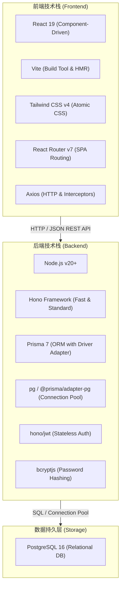
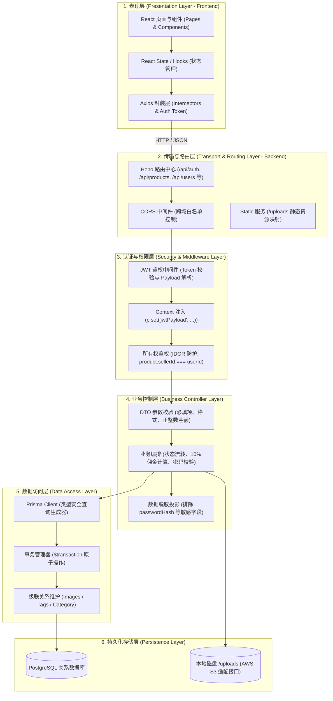
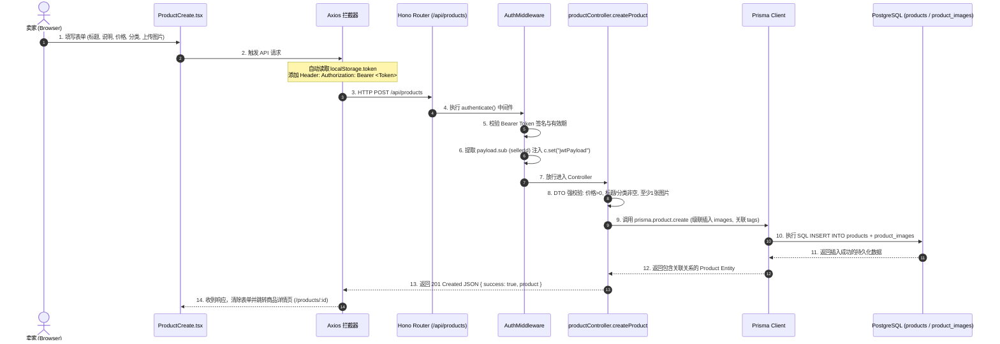

# 01. 技术选型与系统架构设计说明书

## 1. 系统概述与设计目标

本项目为企业级 **C2C 二手跳蚤市场（Flea Market）Web 应用程序**，模拟真实的二手电商交易生态（涵盖用户认证、商品发布与多维检索、图片上传、无限级分类、订单交易流转、双向互评、平台抽成结算与内容风控等功能）。

### 核心设计目标
1. **高内聚低耦合分层架构**：清晰分离视图展现层、API 路由层、中间件鉴权层、业务控制层、数据访问层与持久化存储层。
2. **端到端类型安全（End-to-End Type Safety）**：前后端统一采用 TypeScript 开发，结合 Prisma ORM 与 DTO 规范，实现从数据库表结构到前端界面的强类型保障。
3. **数据权限与安全性（Security & AuthZ）**：严格防范未认证访问、垂直越权与水平越权（IDOR，Insecure Direct Object Reference），实施敏感信息脱敏与密码强哈希存储。
4. **云原生与可部署性**：适配 AWS 部署规范（兼容 VPC、EC2/ECS、S3 与 RDS 架构约束），支持自动化 CI/CD 流水线与独立集成测试。

---

## 2. 技术栈选型与决策依据 (Tech Stack)



### 2.1 后端技术栈决策

| 选型组件 | 采用技术 | 选型原因与架构考量 | 对比替代方案 |
| :--- | :--- | :--- | :--- |
| **运行时环境** | **Node.js (v20+ LTS)** | 拥有成熟的生态系统、高并发异步 I/O 能力以及全栈 TypeScript 统一语言支持。 | Bun / Deno |
| **Web 框架** | **Hono** | 1. **高性能与极低开销**：采用 RegExp 路由树，性能远超传统 Express；<br>2. **Web 标准规范**：基于标准 `Request` / `Response` / `Fetch API` 设计，未来无缝适配 AWS Lambda / Cloudflare Workers 等 Serverless 架构；<br>3. **TypeScript 原生支持**：类型推导极致友好，上下文（`Context`）类型扩展简便。 | Express (老旧庞大)<br>NestJS (抽象层过重) |
| **ORM 数据访问层** | **Prisma 7** | 1. **Schema 驱动开发**：单一 `schema.prisma` 驱动迁移、生成 TypeScript 类型；<br>2. **Prisma 7 驱动适配器**：采用 `@prisma/adapter-pg`，避免传统 Rust 引擎过载问题，精准复用原生 Node `pg` 连接池；<br>3. **安全查询构建**：原生防 SQL 注入，支持级联创建与原子事务 (`$transaction`)。 | TypeORM / Sequelize |
| **数据库** | **PostgreSQL 16** | 支持 ACID 事务、强约束外键、复杂 JSON 查询以及全文不区分大小写检索 (`mode: "insensitive"`)，完美契合电商金钱结算与交易状态机需求。 | MySQL / MongoDB |
| **认证与安全** | **JWT (`hono/jwt`) + `bcryptjs`** | 1. **无状态认证（Stateless）**：减轻服务端内存会话负担，水平扩展友好；<br>2. **盐值哈希加密**：单向不可逆加密，严格防止密码泄露；<br>3. **强密码校验规范**：强制 8~24 位，含大小写字母、数字与特殊字符。 | Session/Cookie |
| **自动化测试** | **Vitest** | 零配置支持 TypeScript 与 ESM，测试速度极快；采用真实 PostgreSQL 数据库进行集成测试（非 Mock），保证接口真实可靠。 | Jest |

### 2.2 前端技术栈决策

| 选型组件 | 采用技术 | 选型原因与架构考量 |
| :--- | :--- | :--- |
| **核心框架** | **React 19** | 组件化状态管理，生态丰富，支持现代 Hooks 与并发特性。 |
| **构建工具** | **Vite** | 极速冷启动（ESM 原生加载）与毫秒级热模块替换（HMR），大幅提升开发体验。 |
| **样式方案** | **Tailwind CSS v4** | 原子化 CSS 引擎，零运行时开销，响应式设计极其敏捷，保证 UI 一致性。 |
| **单页路由** | **React Router v7** | 声明式路由与保护路由守卫（`ProtectedRoute`），支持细粒度鉴权拦截与重定向。 |
| **网络请求** | **Axios** | 强大的请求与响应拦截器机制：自动挂载 `Authorization: Bearer <Token>`，全局统一捕获 401 认证过期并自动清空凭据重定向。 |

---

## 3. 全局系统分层架构设计

系统遵循经典分层架构（Layered Architecture）原则，各层职责边界清晰，单向依赖：



---

## 4. 端到端数据流转模型 (End-to-End Data Flow)

### 4.1 典型业务场景：用户发布新商品数据流



---

## 5. 项目 Monorepo 目录结构规范

项目基于 **pnpm workspace** 构建 Monorepo 代码库，保障前后端代码解耦但共享根配置与 CI/CD 流水线：

```text
fleemarket/
├── backend/                       # 后端工程 (Hono + Prisma + TypeScript)
│   ├── prisma/                    # 数据库模式与迁移
│   │   ├── migrations/            # 历史 SQL 迁移文件
│   │   ├── seed-data/             # 预置种子数据 (分类、标签)
│   │   ├── schema.prisma          # 生产级 Prisma 7 数据模型定义
│   │   └── seed.ts                # 种子数据填充执行脚本
│   ├── src/                       # 后端业务源码
│   │   ├── controllers/           # 控制器层 (user, product, category, upload)
│   │   ├── middleware/            # 中间件层 (authMiddleware 鉴权)
│   │   ├── routes/                # 路由定义与测试用例 (*.test.ts)
│   │   ├── lib/                   # 基础设施 (prisma 实例与连接池)
│   │   └── index.ts               # Hono 服务入口与全局配置
│   ├── uploads/                   # 本地文件存储目录 (带 .gitkeep)
│   ├── vitest.config.ts           # Vitest 集成测试配置
│   └── package.json
├── frontend/                      # 前端工程 (React 19 + Vite + Tailwind v4)
│   ├── src/
│   │   ├── api/                   # Axios 实例与全局拦截器
│   │   ├── assets/                # 静态静态图标与图片
│   │   ├── components/            # 公共组件 (ProtectedRoute 路由守卫等)
│   │   ├── pages/                 # 核心业务页面 (Login, Register, Search, Detail, Create)
│   │   ├── App.tsx                # 路由树总控
│   │   └── main.tsx               # React DOM 渲染入口
│   ├── vite.config.ts             # Vite 构建与插件配置
│   └── package.json
├── doc/                           # 项目工程与架构文档
│   ├── 01_技术选型与系统架构设计.md
│   ├── 02_需求分析与用例规格说明书.md
│   ├── 03_数据模型与数据库设计说明书.md
│   ├── 04_RESTful_API接口规格说明书.md
│   ├── 05_项目开发步骤与实施路线图.md
│   ├── 06_项目开发进度与任务看板.md
│   └── openapi.yaml               # OpenAPI 3.0 标准 API 契约
├── .env.example                   # 环境变量示例模板
├── .gitignore                     # 全面排除规则
├── pnpm-workspace.yaml            # 工作区声明文件
└── package.json                   # 根级启动与构建脚本
```
