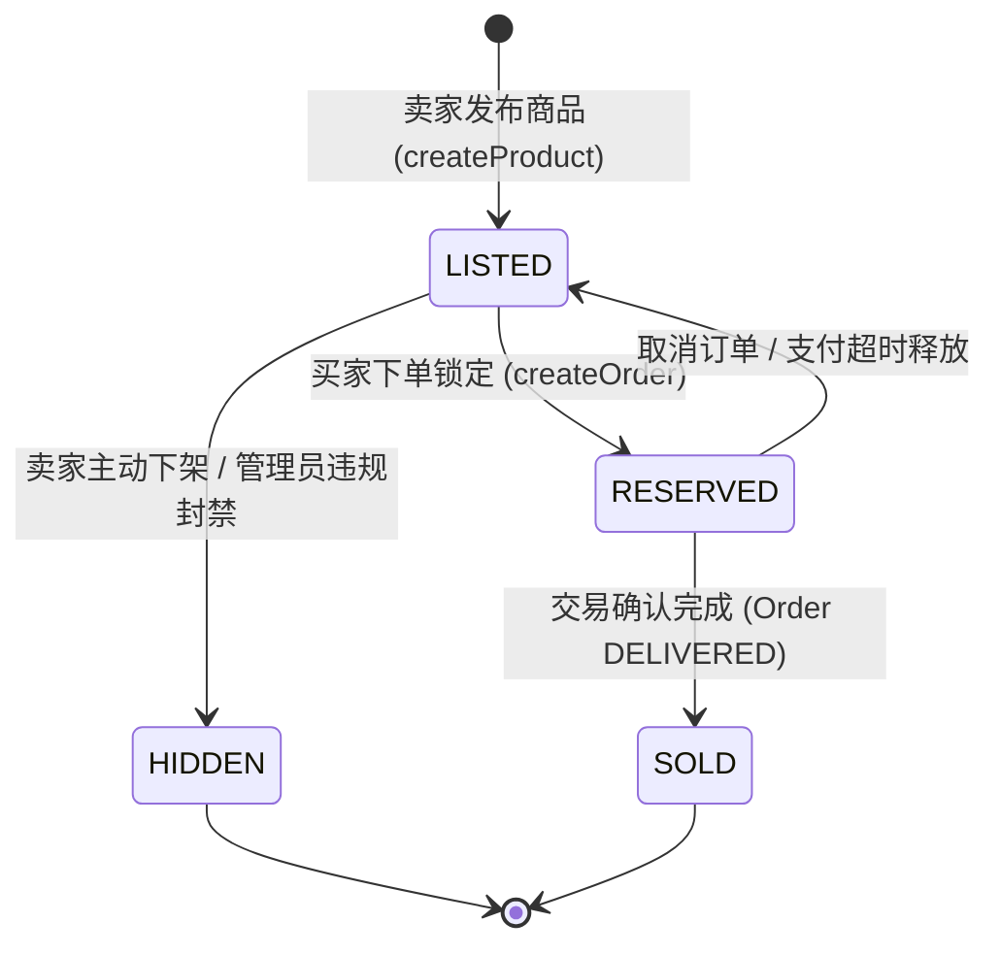
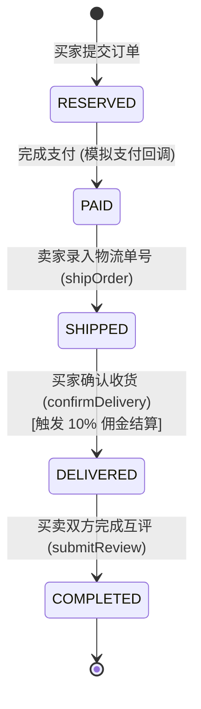

# 02. 需求分析与用例规格说明书

## 1. 领域术语表 (Domain Glossary)

为了确保开发、测试与业务评审团队对核心概念理解一致，定义中日英三语对照术语表：

| 英文标识 (Code/Key) | 日文原名 (Japanese) | 中文术语 (Chinese) | 业务定义与领域概念 |
| :--- | :--- | :--- | :--- |
| **user** | ユーザー | 用户 / 会员 | 注册系统的基本实体，兼具买家与卖家双重身份。 |
| **seller** | 出品者 | 卖家 | 在平台上发布在售商品的发布者。 |
| **buyer** | 購入者 | 买家 | 浏览并下单购买商品的消费者。 |
| **product / listing** | 商品 / 出品物 | 商品 / 挂牌物 | 用户上架交易的实体物品，包含图文、成色与价格。 |
| **order** | 注文 / 取引 | 订单 / 交易 | 买家拍下商品后建立的契约实例。 |
| **shipment** | 発送 | 发货 / 履约 | 卖家向买家寄送商品并录入快递物流单号的过程。 |
| **delivered** | 配送完了 / 受取済み | 确认收货 / 配送完成 | 买家收到货物并在系统确认，触发资金解冻与结算。 |
| **payment** | 決済 / 支払 | 支付 / 结算 | 买家对订单履约款项的充值或支付操作。 |
| **balance / sale** | 売上 / 残高 | 卖家销售额 / 余额 | 扣除平台手续费（10%）后打入卖家账户的可用金额。 |
| **payout** | 売上振込 | 提现申请 | 卖家将平台可用余额申请打入个人真实银行账户。 |
| **rating / review** | 評価 / レビュー | 信用评价 / 评分 | 交易完成后双方给出的 1~5 星评分与文本评语。 |
| **favorite** | お気に入り | 收藏 / 关注 | 用户标记感兴趣商品便于日后查看的行为。 |
| **comment** | コメント | 留言 / 议价咨询 | 用户在商品公开页面下的公开留言或卖家答疑。 |
| **notification** | 通知 | 消息通知 | 系统在关键履约节点（下单、发货、评价、风控）向用户投递的提醒。 |
| **report** | 通報 | 举报 / 风控审核 | 用户对违规商品或不当言论向管理员提起的合规审查请求。 |

---

## 2. 用户角色与权限矩阵 (RBAC & AuthZ Matrix)

| 功能操作 / 资源 | 游客 (Guest) | 普通登录用户 (Buyer/Seller) | 资源所有者 (Resource Owner) | 平台管理员 (Admin) |
| :--- | :---: | :---: | :---: | :---: |
| 浏览商品列表 / 搜索 / 详情 | ✅ | ✅ | ✅ | ✅ |
| 查看公共分类与标签 | ✅ | ✅ | ✅ | ✅ |
| 用户注册 / 登录 | ✅ | ✅ | ✅ | ✅ |
| 修改个人资料 (姓名/地址/电话) | ❌ | ❌ | ✅ (仅本人) | ✅ |
| 发布商品 / 上传商品图片 | ❌ | ✅ | ✅ | ✅ |
| 编辑商品 / 下架已发布商品 | ❌ | ❌ | ✅ (仅卖家本人) | ✅ (违规强制下架) |
| 拍下商品 (创建订单) | ❌ | ✅ (非自己发布的商品) | ❌ (不可买自己的) | ❌ |
| 录入发货单号 (発送) | ❌ | ❌ | ✅ (仅该订单卖家) | ❌ |
| 确认收货 (受取) | ❌ | ❌ | ✅ (仅该订单买家) | ❌ |
| 提交双向交易评价 | ❌ | ❌ | ✅ (该订单买卖双方) | ❌ |
| 收藏商品 / 发表公开评论 | ❌ | ✅ | ✅ | ✅ |
| 查看个人余额 / 申请提现 | ❌ | ❌ | ✅ (仅本人) | ✅ |
| 提交违规举报 (商品/评论) | ❌ | ✅ | ✅ | ✅ |
| 审核举报 / 封禁违规用户 | ❌ | ❌ | ❌ | ✅ |

---

## 3. 11 大核心功能用例规格说明 (Functional Use Cases)

### 3.1 模块一：用户管理 (User Management)
- **UC-01 注册账号**：
  - 输入：邮箱 (`email`)、密码 (`password`)、用户名 (`username`)。
  - 校验：邮箱全局唯一；密码强制 8~24 位且包含大写字母、小写字母、数字及特殊符号。
  - 存储：服务端采用 `bcrypt` 生成 Salt 并对密码哈希存储，禁止明文落库。
- **UC-02 用户登录**：
  - 输入：邮箱、密码。
  - 处理：通过 `bcrypt.compare` 比对哈希，验证通过后签发无状态 JWT Token（默认 7 天有效）。
- **UC-03 个人资料维护**：
  - 登录后支持修改：用户名、邮箱、密码、手机号、收货地址（默认发货目的地）、自我介绍（Bio）。

---

### 3.2 模块二：商品搜索与多维检索 (Product Search & Filter)
- **UC-04 商品列表检索**：
  - 仅公开展示状态为 `LISTED`（在售）的商品。
  - **支持多维组合筛选**：
    1. **分类筛选 (`categoryId`)**：支持筛选某具体分类下的商品。
    2. **关键词搜索 (`keyword`)**：对商品标题进行不区分大小写模糊匹配 (`ILIKE` / `mode: "insensitive"`）。
    3. **价格区间筛选 (`minPrice` / `maxPrice`)**：支持限定最低与最高价格。
    4. **排序机制**：默认按 `createdAt DESC`（最新发布倒序），列表只拉取首张主图以优化加载效率。

---

### 3.3 模块三：商品出品与生命周期管理 (Product Listing)
- **UC-05 商品发布 (出品)**：
  - 必填信息：商品标题、详细描述、价格（必须为大于 0 的数字）、商品成色/状态（`condition`：如新品/良好/二手等）、分类（单选，支持无限层级分类树）。
  - 扩展属性：标签（`tagIds`，多选）、商品图片（`imageUrls`，至少 1 张，按序号 `sortOrder` 排序）。
  - 状态初始化：发布成功后商品状态为 `LISTED`。
- **UC-06 商品编辑与下架 (更新与软删除)**：
  - 必须校验**资源所有权**（`product.sellerId === currentUserId`），严禁越权修改他人商品。
  - **下架策略**：采用软删除，将状态由 `LISTED` 变更为 `HIDDEN`，保留历史订单和评价的引用完整性。

---

### 3.4 模块四 & 五：商品购买、支付与履约发货 (Order & Fulfillment)
- **UC-07 创建订单与锁定**：
  - 买家对 `LISTED` 商品发起购买请求，系统校验买家不可购买自己发布的商品。
  - 开启原子事务：商品状态由 `LISTED` ➔ `RESERVED`，生成订单（状态 `RESERVED`）。
- **UC-08 支付流转 (模拟支付)**：
  - 支付完成后订单状态流转为 `PAID`（待发货）。
- **UC-09 卖家发货**：
  - 卖家录入物流单号 (`trackingNumber`)，订单状态流转为 `SHIPPED`（已发货）。
- **UC-10 买家确认收货**：
  - 买家确认到货，订单流转为 `DELIVERED`（已送达），触发资金结算并开启评价通道。

---

### 3.5 模块六：双向交易评价 (Rating & Review)
- **UC-11 订单互评**：
  - 订单进入 `DELIVERED` 后，买卖双方可针对该笔交易互打 1~5 星并附带文本评价。
  - 数据库防刷设计：通过复合唯一索引 `@@unique([orderId, reviewerRole])` 保证单笔订单中买家与卖家各自最多只能评价 1 次。
  - 双方完成评价后，订单状态流转为最终态 `COMPLETED`。

---

### 3.6 模块七：资金流与结算管理 (Balance & Payout)
- **UC-12 销售额入账与佣金抽成**：
  - 当订单达成 `DELIVERED` 时，系统自动计算卖家收益：
    $$\text{平台手续费 (Fee)} = \text{商品金额} \times 10\%$$
    $$\text{卖家净收益 (Net Amount)} = \text{商品金额} \times 90\%$$
  - 生成 `BalanceTransaction` 流水记录（类型 `CREDIT`）。
- **UC-13 余额提现申请**：
  - 卖家可录入银行账户信息（`bankAccountInfo`），申请将平台可用余额提现。

---

### 3.7 模块八 ~ 十一：社交、通知与风控治理 (Social & Governance)
- **UC-14 商品收藏 (Favorites)**：用户可将商品加入收藏夹，支持查看自己收藏的列表及商品的总被收藏数。
- **UC-15 评论与回复 (Comments)**：支持在商品页面下公开发表评论及层级回复（`parentId` 自关联）。
- **UC-16 事件驱动通知 (Notifications)**：在商品被购买、发货、收到评价、违规警告时，系统自动给目标用户生成站内信通知。
- **UC-17 违规通报与合规治理 (Reports)**：
  - 用户可对违规商品或不当言论发起通报。
  - 管理员可进行处理（标记 `WARNING` 警告或 `REMOVED` 强制下架）。
  - 用户累计违规达到阈值后，账号状态被置为 `SUSPENDED`（封禁）。

---

## 4. 核心领域状态机设计 (Domain State Machines)

### 4.1 商品生命周期状态机 (Product Lifecycle)

### 4.2 订单履约生命周期状态机 (Order Fulfillment Lifecycle)

