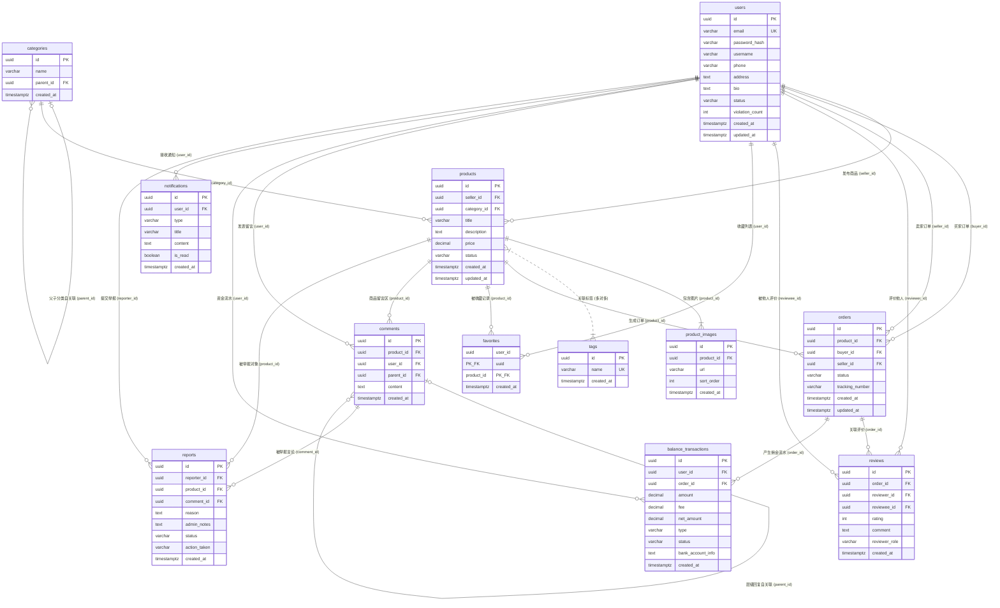

# 03. 数据模型与数据库设计说明书

## 1. 数据库架构与设计准则

本项目选用 **PostgreSQL 16** 关系型数据库，结合 **Prisma 7 ORM** 与 `@prisma/adapter-pg` 原生连接池适配器进行数据建模与持久化操作。

### 核心设计准则
1. **主键统一使用 UUID**：全表主键统一使用 `uuid` 类型（标准 RFC 4122），防止自增 ID 带来的业务数据量爬取与枚举安全风险。
2. **时区与时间规范**：时间字段统一采用 `TIMESTAMPTZ`（带时区时间戳），在 PostgreSQL 中精准记录全球统一的 UTC 时间戳。
3. **软删除与历史留存**：商品状态使用 `HIDDEN` 软删除，避免硬删除导致订单、历史评价和账单外键断裂。
4. **精细化级联策略**：严格区分 `Cascade`（级联删除）、`Restrict`（限制删除）与 `SetNull`（置空），保护交易核心数据的引用完整性。

---

## 2. 实体关系图 (Entity Relationship Diagram)

---

## 3. 详细数据字典 (Data Dictionary)

### 3.1 用户表 (`users`)
| 字段名 | 类型 | 约束 | 默认值 | 业务说明 |
| :--- | :--- | :--- | :--- | :--- |
| `id` | UUID | PK, NOT NULL | `uuid()` | 用户全局唯一标识 |
| `email` | VARCHAR(255) | UK, NOT NULL | - | 登录邮箱（全局唯一） |
| `password_hash` | VARCHAR(255) | NOT NULL | - | bcrypt 盐值哈希加密字符串 |
| `username` | VARCHAR(100) | NOT NULL | - | 用户昵称/显示名称 |
| `phone` | VARCHAR(20) | NULL | - | 电话号码 |
| `address` | TEXT | NULL | - | 默认收货与发货地址 |
| `bio` | TEXT | NULL | - | 个人主页自我介绍 |
| `status` | ENUM | NOT NULL | `ACTIVE` | 用户状态 (`ACTIVE`, `SUSPENDED`) |
| `violation_count` | INTEGER | NOT NULL | `0` | 累计违规次数计数 |
| `created_at` | TIMESTAMPTZ | NOT NULL | `NOW()` | 账号创建时间 |
| `updated_at` | TIMESTAMPTZ | NOT NULL | `NOW()` | 资料最后更新时间 |

---

### 3.2 分类表 (`categories` - 无限级自关联)
| 字段名 | 类型 | 约束 | 默认值 | 业务说明 |
| :--- | :--- | :--- | :--- | :--- |
| `id` | UUID | PK, NOT NULL | `uuid()` | 分类唯一标识 |
| `name` | VARCHAR(100) | NOT NULL | - | 分类名称（如：时尚、女装、外套） |
| `parent_id` | UUID | FK, NULL | - | 父级分类 ID（自关联，顶层为 NULL） |
| `created_at` | TIMESTAMPTZ | NOT NULL | `NOW()` | 创建时间 |

> **索引说明**：建立复合唯一索引 `@@unique([parentId, name])`，保证同一父分类下的子分类不重名；建立 `@@index([parentId])` 提升树形递归查询性能。

---

### 3.3 标签表 (`tags`)
| 字段名 | 类型 | 约束 | 默认值 | 业务说明 |
| :--- | :--- | :--- | :--- | :--- |
| `id` | UUID | PK, NOT NULL | `uuid()` | 标签唯一标识 |
| `name` | VARCHAR(50) | UK, NOT NULL | - | 标签名称（如：户外、限定款） |
| `created_at` | TIMESTAMPTZ | NOT NULL | `NOW()` | 创建时间 |

---

### 3.4 商品主表 (`products`)
| 字段名 | 类型 | 约束 | 默认值 | 业务说明 |
| :--- | :--- | :--- | :--- | :--- |
| `id` | UUID | PK, NOT NULL | `uuid()` | 商品唯一标识 |
| `seller_id` | UUID | FK, NOT NULL | - | 卖家用户 ID (`users.id`) |
| `category_id` | UUID | FK, NOT NULL | - | 所属最末级分类 ID (`categories.id`) |
| `title` | VARCHAR(255) | NOT NULL | - | 商品标题 |
| `description` | TEXT | NOT NULL | - | 商品详细图文说明 |
| `price` | DECIMAL(10,2) | NOT NULL | - | 商品标价（单位：日元/货币基数） |
| `status` | ENUM | NOT NULL | `LISTED` | 商品状态 (`LISTED`, `RESERVED`, `SOLD`, `HIDDEN`) |
| `created_at` | TIMESTAMPTZ | NOT NULL | `NOW()` | 上架时间 |
| `updated_at` | TIMESTAMPTZ | NOT NULL | `NOW()` | 信息更新时间 |

> **索引设计**：
> - `@@index([sellerId])`：加速卖家个人在售商品查询。
> - `@@index([categoryId])`：加速分类筛选。
> - `@@index([status, price])`：覆盖索引，加速商品首页在售列表与价格区间复合过滤。

---

### 3.5 商品图片表 (`product_images`)
| 字段名 | 类型 | 约束 | 默认值 | 业务说明 |
| :--- | :--- | :--- | :--- | :--- |
| `id` | UUID | PK, NOT NULL | `uuid()` | 图片唯一标识 |
| `product_id` | UUID | FK, NOT NULL | - | 归属商品 ID（级联删除 `onDelete: Cascade`） |
| `url` | VARCHAR(512) | NOT NULL | - | 图片访问 URI 路径 |
| `sort_order` | INTEGER | NOT NULL | `0` | 排序权重（0 为封面主图，依次递增） |
| `created_at` | TIMESTAMPTZ | NOT NULL | `NOW()` | 上传时间 |

---

### 3.6 交易订单表 (`orders`)
| 字段名 | 类型 | 约束 | 默认值 | 业务说明 |
| :--- | :--- | :--- | :--- | :--- |
| `id` | UUID | PK, NOT NULL | `uuid()` | 订单唯一编号 |
| `product_id` | UUID | FK, NOT NULL | - | 交易商品 ID (`products.id`) |
| `buyer_id` | UUID | FK, NOT NULL | - | 买家用户 ID (`users.id`) |
| `seller_id` | UUID | FK, NOT NULL | - | 卖家用户 ID (`users.id`) |
| `status` | ENUM | NOT NULL | `RESERVED` | 订单状态 (`RESERVED`, `PAID`, `SHIPPED`, `DELIVERED`, `COMPLETED`) |
| `tracking_number` | VARCHAR(100) | NULL | - | 快递发货物流追踪单号 |
| `created_at` | TIMESTAMPTZ | NOT NULL | `NOW()` | 下单时间 |
| `updated_at` | TIMESTAMPTZ | NOT NULL | `NOW()` | 履约状态最后更新时间 |

---

### 3.7 信用评价表 (`reviews`)
| 字段名 | 类型 | 约束 | 默认值 | 业务说明 |
| :--- | :--- | :--- | :--- | :--- |
| `id` | UUID | PK, NOT NULL | `uuid()` | 评价唯一标识 |
| `order_id` | UUID | FK, NOT NULL | - | 关联订单 ID (`orders.id`) |
| `reviewer_id` | UUID | FK, NOT NULL | - | 评价人 ID |
| `reviewee_id` | UUID | FK, NOT NULL | - | 被评价人 ID |
| `rating` | INTEGER | NOT NULL | - | 评分星级（1 ~ 5 分） |
| `comment` | TEXT | NULL | - | 评价评语详情 |
| `reviewer_role` | ENUM | NOT NULL | - | 评价人角色 (`BUYER`, `SELLER`) |
| `created_at` | TIMESTAMPTZ | NOT NULL | `NOW()` | 评价提交时间 |

> **唯一性防刷约束**：`@@unique([orderId, reviewerRole])`，买卖双方单笔订单各自只能提交一份评价。

---

### 3.8 资金流水与提现表 (`balance_transactions`)
| 字段名 | 类型 | 约束 | 默认值 | 业务说明 |
| :--- | :--- | :--- | :--- | :--- |
| `id` | UUID | PK, NOT NULL | `uuid()` | 流水全局唯一编号 |
| `user_id` | UUID | FK, NOT NULL | - | 用户 ID |
| `order_id` | UUID | FK, NULL | - | 关联订单 ID（提现操作时为 NULL） |
| `amount` | DECIMAL(10,2) | NOT NULL | - | 交易总金额 |
| `fee` | DECIMAL(10,2) | NOT NULL | `0.00` | 平台扣除的手续费 (10%) |
| `net_amount` | DECIMAL(10,2) | NOT NULL | - | 最终打入或扣减的净额 (90%) |
| `type` | ENUM | NOT NULL | - | 流水类型 (`CREDIT` 入账, `DEBIT` 提现出账) |
| `status` | ENUM | NOT NULL | `PENDING` | 状态 (`PENDING`, `COMPLETED`, `FAILED`) |
| `bank_account_info` | TEXT | NULL | - | 提现时的收款银行账户信息 |
| `created_at` | TIMESTAMPTZ | NOT NULL | `NOW()` | 流水生成时间 |

---

### 3.9 商品收藏表 (`favorites`)
| 字段名 | 类型 | 约束 | 默认值 | 业务说明 |
| :--- | :--- | :--- | :--- | :--- |
| `user_id` | UUID | PK_FK, NOT NULL | - | 用户 ID |
| `product_id` | UUID | PK_FK, NOT NULL | - | 商品 ID |
| `created_at` | TIMESTAMPTZ | NOT NULL | `NOW()` | 收藏时间 |

> **主键设计**：`@@id([userId, productId])` 复合主键，防止重复收藏。

---

### 3.10 留言评论表 (`comments`)
| 字段名 | 类型 | 约束 | 默认值 | 业务说明 |
| :--- | :--- | :--- | :--- | :--- |
| `id` | UUID | PK, NOT NULL | `uuid()` | 评论唯一标识 |
| `product_id` | UUID | FK, NOT NULL | - | 归属商品 ID |
| `user_id` | UUID | FK, NOT NULL | - | 发布者用户 ID |
| `parent_id` | UUID | FK, NULL | - | 父级评论 ID（回复他人时非空） |
| `content` | TEXT | NOT NULL | - | 留言正文 |
| `created_at` | TIMESTAMPTZ | NOT NULL | `NOW()` | 发布时间 |

---

### 3.11 消息通知表 (`notifications`) 与 违规举报表 (`reports`)
- **`notifications`**：包含 `userId`, `type` (`TRANSACTION`, `SYSTEM`, `RISK`), `title`, `content`, `isRead`（默认 false），支持 `@@index([userId, isRead])` 高效拉取未读消息。
- **`reports`**：包含 `reporterId`, `productId`, `commentId`, `reason`, `adminNotes`, `status` (`PENDING`, `INVESTIGATING`, `RESOLVED`, `DISMISSED`), `actionTaken` (`NONE`, `WARNING`, `REMOVED`)。
