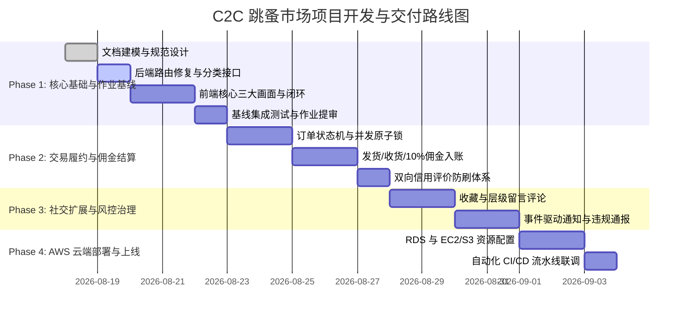
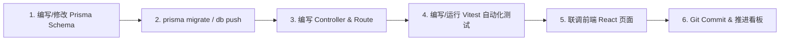

# 05. 项目开发步骤与实施路线图

## 1. 总体实施策略 (Implementation Strategy)

本项目采用 **文档先行（Schema-First & Doc-Driven）** 与 **领域分阶段渐进式演进（Phased Agile Delivery）** 相结合的工程策略。

将整个跳蚤市场系统划分为 4 个演进阶段，每个阶段均具备明确的**输入前提**、**核心编码任务**、**测试验证标准**与**交付物基线**：

---

## 2. 各阶段详细开发步骤与任务分解

### 2.1 第一阶段：核心基础与作业达标基线 (Phase 1: MVP Baseline)
> **目标**：满足公司培训《バックエンド_課題》与《フロントエンド_課題》的核心必做要求，完成从注册登录到商品发布、检索、查看的完整前后端闭环。

#### 1. 数据库与后端服务
- [x] 完成 PostgreSQL 数据库初始化与 Prisma Schema 迁移（11 张表结构）。
- [x] 执行 `seed.ts` 初始化预置分类（`categories`）与标签（`tags`）。
- [x] 修正 `backend/src/index.ts` 路由挂载（挂载 `products`, `users`, `categories`, `tags`）。
- [x] 补齐 `productController.ts` 中多维筛选逻辑（关键词、分类、价格区间）。
- [x] 实现 `userController.ts` 个人信息查看与编辑接口 (`GET/PUT /api/users/me`)。
- [x] 实现 `categoryController.ts` 分类树与标签查询接口。

#### 2. 前端界面与交互闭环
- [x] 完善 Axios 拦截器与 Token 自动续航/过期重定向。
- [ ] 调整登录成功后的跳转逻辑：登录后直达 **商品检索页面（`/products`）**。
- [ ] 构建 **商品检索画面 (`ProductSearch.tsx`)**：
  - 顶部搜索栏、分类下拉树筛选、价格区间输入框。
  - 在售商品网格展示卡片（首图、标题、价格、发布时间）。
  - 右上角「出品」快捷发布按钮与个人中心入口。
- [ ] 构建 **商品详情画面 (`ProductDetail.tsx`)**：
  - 商品多图相册轮播、详细描述、分类面包屑、标签徽章、卖家脱敏公开信息。
  - 「戻る」返回搜索页按钮与卖家本人的「下架」操作。
- [ ] 构建 **商品出品画面 (`ProductCreate.tsx`)**：
  - 表单输入（标题、图文描述、价格、分类联动选择、标签多选）。
  - 多图本地选择、调用 `/api/upload` 上传并实时预览。
  - 发布成功后自动路由跳转至新商品的详情页。

#### 3. 验证与交付标准
- 运行 `pnpm test` 通过 Vitest 集成测试套件。
- 完整跑通注册 ➔ 登录 ➔ 搜索筛选 ➔ 发布商品 ➔ 查看详情 ➔ 下架软删除全链路。

---

### 2.2 第二阶段：交易履约与资金结算 (Phase 2: Order & Settlement)
> **目标**：实现 C2C 核心交易流程、并发防超卖原子事务、10% 佣金自动抽成与双向防刷评价。

#### 1. 核心任务
- 实现 `orderController.ts`：
  - `POST /api/orders`：使用 `prisma.$transaction` 原子锁定商品状态（`LISTED -> RESERVED`）并生成订单。
  - `POST /api/orders/:id/pay`：模拟支付成功，订单流转为 `PAID`。
  - `PUT /api/orders/:id/ship`：卖家录入物流追踪单号，流转为 `SHIPPED`。
  - `PUT /api/orders/:id/deliver`：买家确认收货，流转为 `DELIVERED`，触发佣金计算：
    - 手续费 $\text{Fee} = \text{Price} \times 10\%$
    - 净收益 $\text{Net} = \text{Price} \times 90\%$
    - 向 `balance_transactions` 插入流水。
- 实现 `reviewController.ts`：
  - `POST /api/orders/:id/reviews`：买卖双方提交 1~5 星与评语，双方完成后订单置为 `COMPLETED`。

---

### 2.3 第三阶段：社交互动、通知与合规治理 (Phase 3: Social & Governance)
> **目标**：提升平台用户粘性与合规风控能力。

#### 1. 核心任务
- **收藏夹模块 (`/api/favorites`)**：支持商品一键收藏/取消，展示收藏总计数。
- **商品留言区 (`/api/comments`)**：支持多级层级嵌套回复。
- **通知中心 (`/api/notifications`)**：在履约各节点异步生成站内通知。
- **风控与通报 (`/api/reports`)**：用户举报违规商品，管理员后台审核并执行违规封禁。

---

### 2.4 第四阶段：AWS 云端部署与 CI/CD 自动化 (Phase 4: Cloud Architecture)
> **目标**：严格满足《クラウドサービス_AWS_課題.md》的约束指标，完成云端高可用部署。

#### 1. AWS 架构与资源规划 (ap-northeast-1 东京区域)
- **Tag 统一规范**：所有资源强制打标 `Owner: pavct.taro`, `Project: new-comer-2026`。
- **网络 (VPC)**：复用默认 VPC，配置安全组（Security Group）精确放通端口（API 3000, DB 5432, Web 80/443）。
- **数据库 (RDS)**：单实例 `db.t3.micro` PostgreSQL 16，禁止公网访问，仅允许后端 EC2 安全组内网穿透。
- **计算与容器 (EC2 / ECS)**：采用 `t2.micro` 实例运行 Node.js 后端服务或 Docker 容器。
- **前端托管**：S3 私有桶 + CloudFront 分发，或 EC2 Nginx 反向代理。
- **GitLab CI / GitHub Actions**：配置 Lint ➔ Integration Test (临时 Docker DB) ➔ Build 自动化三阶段流水线。

---

## 3. 标准开发与调试工作流 (Developer Daily Workflow)

