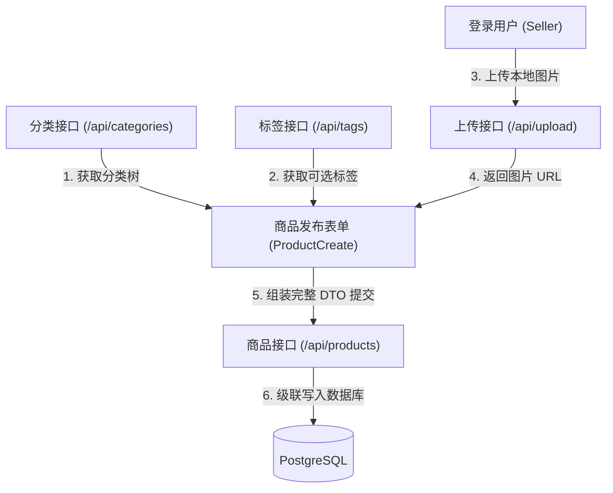

# 01. 商品与元数据模块全栈开发实战教学

本教程将手把手带你完成跳蚤市场系统中最核心的基础模块：**分类元数据（Categories）、标签（Tags）、图片上传（Upload）以及商品发布/检索/修改/下架（Products）** 的前后端全栈开发。

---

## 目录
1. [模块全景与数据流图解](#1-模块全景与数据流图解)
2. [后端实战：从元数据到商品接口](#2-后端实战从元数据到商品接口)
   - [步骤 1：分类与标签元数据接口 (Categories & Tags)](#步骤-1分类与标签元数据接口-categories--tags)
   - [步骤 2：媒体图片上传服务 (Upload)](#步骤-2媒体图片上传服务-upload)
   - [步骤 3：商品核心 CRUD 业务控制层 (Product Controller)](#步骤-3商品核心-crud-业务控制层-product-controller)
   - [步骤 4：路由中枢注册与挂载 (Index Routing)](#步骤-4路由中枢注册与挂载-index-routing)
3. [前端实战：商品三大核心画面构建](#3-前端实战商品三大核心画面构建)
   - [步骤 1：API 封装层与类型定义](#步骤-1api-封装层与类型定义)
   - [步骤 2：商品检索画面 (ProductSearch.tsx)](#步骤-2商品检索画面-productsearchtsx)
   - [步骤 3：商品详情画面 (ProductDetail.tsx)](#步骤-3商品详情画面-productdetailtsx)
   - [步骤 4：商品出品画面 (ProductCreate.tsx)](#步骤-4商品出品画面-productcreatetsx)
   - [步骤 5：路由中枢配置与登录跳转调整](#步骤-5路由中枢配置与登录跳转调整)
4. [核心设计原理与避坑指南](#4-核心设计原理与避坑指南)

---

## 1. 模块全景与数据流图解

商品模块涉及 4 张数据表（`products`, `product_images`, `categories`, `tags`），它们之间的依赖关系如下：



---

## 2. 后端实战：从元数据到商品接口

### 步骤 1：分类与标签元数据接口 (Categories & Tags)

#### 1.1 业务需求与设计
- **分类（Category）**：支持无限层级嵌套。前端需要获取树形结构的分类数据以供级联选择器使用。
- **标签（Tag）**：多对多关系。前端需要获取全量标签供卖家勾选。

#### 1.2 编写 Controller：`backend/src/controllers/categoryController.ts`
```typescript
import { Context } from "hono";
import { prisma } from "../lib/prisma.js";

/**
 * 1. 获取全量分类树 (GET /api/categories)
 * 逻辑：查询所有顶层分类 (parentId 为 null)，并递归嵌套查询其下层 children
 */
export const getCategories = async (c: Context) => {
  try {
    const categories = await prisma.category.findMany({
      where: {
        parentId: null, // 只取顶级大类
      },
      include: {
        children: {
          include: {
            children: true, // 支持三级分类展开
          },
        },
      },
      orderBy: {
        name: "asc",
      },
    });

    return c.json({ success: true, data: categories });
  } catch (error) {
    console.error("获取分类失败:", error);
    return c.json({ success: false, error: "分类列表获取失败" }, 500);
  }
};

/**
 * 2. 获取标签列表 (GET /api/tags)
 */
export const getTags = async (c: Context) => {
  try {
    const tags = await prisma.tag.findMany({
      orderBy: {
        name: "asc",
      },
    });

    return c.json({ success: true, data: tags });
  } catch (error) {
    console.error("获取标签失败:", error);
    return c.json({ success: false, error: "标签列表获取失败" }, 500);
  }
};
```

#### 1.3 编写路由：`backend/src/routes/categories.ts` 与 `backend/src/routes/tags.ts`
```typescript
// backend/src/routes/categories.ts
import { Hono } from "hono";
import { getCategories } from "../controllers/categoryController.js";

const categoriesRouter = new Hono();
categoriesRouter.get("/", getCategories);
export default categoriesRouter;
```

```typescript
// backend/src/routes/tags.ts
import { Hono } from "hono";
import { getTags } from "../controllers/categoryController.js";

const tagsRouter = new Hono();
tagsRouter.get("/", getTags);
export default tagsRouter;
```

---

### 步骤 2：媒体图片上传服务 (Upload)

#### 2.1 业务需求与设计
- 允许上传 JPG, PNG, WebP 格式的图片，单文件限制在 5MB 以内。
- 上传后生成 UUID 随机文件名保存在服务端的 `uploads/` 目录，并返回绝对路径 `/uploads/xxxx.png`。

#### 2.2 确保 `uploadController.ts` 与 `routes/upload.ts` 正常
查看 [`uploadController.ts`](file:///Users/bianhanzhang/Desktop/projects/fleemarket/backend/src/controllers/uploadController.ts)，代码已具备以下健壮设计：
1. 文件格式白名单校验（`ALLOWED_TYPES`）。
2. 大小防御限制（`MAX_FILE_SIZE = 5 * 1024 * 1024`）。
3. 随机 UUID 命名防止文件名重名覆盖与路径注入。

---

### 步骤 3：商品核心 CRUD 业务控制层 (Product Controller)

#### 3.1 核心方法与安全性设计
打开 [`backend/src/controllers/productController.ts`](file:///Users/bianhanzhang/Desktop/projects/fleemarket/backend/src/controllers/productController.ts)，需要确保以下 5 大方法与安全边界：

1. **`createProduct` (发布商品)**：
   - **身份识别**：从 JWT 载荷中提取 `sellerId = c.get("jwtPayload").sub`。
   - **参数强校验**：`title`, `description`, `price > 0`, `categoryId`, 且 `imageUrls.length > 0`。
   - **Prisma 级联创建**：
     ```typescript
     await prisma.product.create({
       data: {
         sellerId,
         categoryId,
         title,
         description,
         price: Number(price),
         status: ProductStatus.LISTED,
         images: {
           create: imageUrls.map((url, index) => ({ url, sortOrder: index })),
         },
         tags: tagIds.length > 0 ? { connect: tagIds.map(id => ({ id })) } : undefined,
       },
       include: { images: true, tags: true, category: true },
     });
     ```

2. **`getProducts` (商品多维检索)**：
   - 支持多参数组合过滤：
     ```typescript
     const { categoryId, keyword, minPrice, maxPrice } = c.req.query();
     const products = await prisma.product.findMany({
       where: {
         status: ProductStatus.LISTED, // 仅展示在售
         categoryId: categoryId || undefined,
         title: keyword ? { contains: keyword, mode: "insensitive" } : undefined,
         price: (minPrice || maxPrice) ? {
           gte: minPrice ? Number(minPrice) : undefined,
           lte: maxPrice ? Number(maxPrice) : undefined,
         } : undefined,
       },
       include: {
         images: { orderBy: { sortOrder: "asc" }, take: 1 }, // 列表页只需首图
         category: true,
       },
       orderBy: { createdAt: "desc" },
     });
     ```

3. **`getProductById` (商品详情)**：
   - 查出商品全量图片、分类、关联标签。
   - **数据脱敏**：卖家信息只保留公开字段（`id`, `username`, `createdAt`），**严禁返回 passwordHash**。
   - 若商品状态为 `HIDDEN`，返回 `404 Not Found`。

4. **`updateProduct` & `deleteProduct` (修改与下架 - 水平越权防御)**：
   - **关键权限防线**：
     ```typescript
     if (product.sellerId !== currentUserId) {
       return c.json({ success: false, error: "他人の商品を操作する権限がありません。" }, 403);
     }
     ```
   - 下架采用逻辑软删除：`status: ProductStatus.HIDDEN`。

#### 3.2 完善路由映射：`backend/src/routes/products.ts`
```typescript
import { Hono } from "hono";
import { authenticate } from "../middleware/authMiddleware.js";
import {
  createProduct,
  deleteProduct,
  updateProduct,
  getProducts,
  getProductById,
} from "../controllers/productController.js";

const productRouter = new Hono();

// 公开接口 (无需登录)
productRouter.get("/", getProducts);
productRouter.get("/:id", getProductById);

// 保护接口 (必须登录鉴权)
productRouter.post("/", authenticate(), createProduct);
productRouter.put("/:id", authenticate(), updateProduct);
productRouter.delete("/:id", authenticate(), deleteProduct);

export default productRouter;
```

---

### 步骤 4：路由中枢注册与挂载 (Index Routing)

修改 [`backend/src/index.ts`](file:///Users/bianhanzhang/Desktop/projects/fleemarket/backend/src/index.ts)，将各个路由模块挂载到统一前缀：

```typescript
import auth from "./routes/auth.js";
import products from "./routes/products.js";
import categories from "./routes/categories.js";
import tags from "./routes/tags.js";
import upload from "./routes/upload.js";

// 挂载路由
app.route("/api/auth", auth);
app.route("/api/products", products);
app.route("/api/categories", categories);
app.route("/api/tags", tags);
app.route("/api/upload", upload);

// 静态托管上传文件
app.use("/uploads/*", serveStatic({ root: "./" }));
```

---

## 3. 前端实战：商品三大核心画面构建

前端基于 **React 19 + Tailwind CSS + React Router v7 + Axios** 开发。

### 步骤 1：API 封装层与类型定义

在 `frontend/src/api/productApi.ts` 中集中管理商品与元数据网络请求：

```typescript
import api from "./axios";

export interface Category {
  id: string;
  name: string;
  parentId?: string | null;
  children?: Category[];
}

export interface Tag {
  id: string;
  name: string;
}

export interface Product {
  id: string;
  title: string;
  description: string;
  price: string | number;
  status: "LISTED" | "RESERVED" | "SOLD" | "HIDDEN";
  createdAt: string;
  images: { id?: string; url: string; sortOrder?: number }[];
  category?: Category;
  tags?: Tag[];
  seller?: { id: string; username: string; createdAt: string };
}

// 1. 获取商品列表
export const fetchProducts = (params?: { categoryId?: string; keyword?: string; minPrice?: string; maxPrice?: string }) =>
  api.get<{ success: boolean; data: Product[] }>("/products", { params });

// 2. 获取商品详情
export const fetchProductById = (id: string) =>
  api.get<{ success: boolean; data: Product }>(`/products/${id}`);

// 3. 发布商品
export const createProduct = (data: {
  title: string;
  description: string;
  price: number;
  categoryId: string;
  tagIds?: string[];
  imageUrls: string[];
}) => api.post("/products", data);

// 4. 下架商品
export const deleteProduct = (id: string) =>
  api.delete(`/products/${id}`);

// 5. 获取分类树
export const fetchCategories = () =>
  api.get<{ success: boolean; data: Category[] }>("/categories");

// 6. 获取标签列表
export const fetchTags = () =>
  api.get<{ success: boolean; data: Tag[] }>("/tags");

// 7. 图片上传
export const uploadFile = (file: File) => {
  const formData = new FormData();
  formData.append("file", file);
  return api.post<{ success: boolean; url: string }>("/upload", formData, {
    headers: { "Content-Type": "multipart/form-data" },
  });
};
```

---

### 步骤 2：商品检索画面 (ProductSearch.tsx)

#### 功能点与 UI 布局
1. **顶部导航栏**：展示系统 Logo、当前用户名、**「出品 (发布商品)」按钮**、登出按钮。
2. **多维筛选过滤栏**：
   - 关键词搜索框（Keyword Search）。
   - 分类下拉筛选（Category Select）。
   - 价格区间（最低价 - 最高价）。
   - 「重置筛选」与「搜索」按钮。
3. **商品网格卡片列表**：
   - 渲染商品第一张主图（带缺省图占位）。
   - 标题、格式化价格（如 `¥28,000`）、分类标签、发布时间。
   - 点击商品卡片进入商品详情页 `/products/:id`。

---

### 步骤 3：商品详情画面 (ProductDetail.tsx)

#### 功能点与 UI 布局
1. **顶部返回按钮**：「戻る (返回检索画面)」路由跳转至 `/products`。
2. **左侧大图相册与缩略图切换**：支持点击下方缩略图切换上方大图。
3. **右侧商品详细信息**：
   - 商品标题与价格（高亮醒目展示）。
   - 分类徽章与关联标签徽章（Tag Badges）。
   - 卖家公开信息展示（用户名、注册时间）。
   - 商品详细图文说明文本。
4. **操作按钮区域**：
   - 若是买家浏览：展示「購入手続きへ (立即购买)」（为 Phase 2 预留）。
   - 若是发布者本人：展示「この商品を取り下げる (下架商品)」按钮，确认后调用 `DELETE /api/products/:id` 软删除并返回列表。

---

### 步骤 4：商品出品画面 (ProductCreate.tsx)

#### 功能点与交互逻辑
1. **多图上传组件**：
   - 支持点击文件选择或拖拽。
   - 选择图片后即时调用 `uploadFile(file)` 上传至后端，将后端返回的 `/uploads/xxx.png` 存储至表单状态数组 `imageUrls` 中。
   - 支持图片缩略图实时预览与单张删除按钮。
2. **分类下拉选择器**：动态加载 `/api/categories` 数据，支持选择目标分类。
3. **标签多选复选框**：动态加载 `/api/tags`，支持点击勾选多个标签 ID (`tagIds`)。
4. **价格与文本输入**：正整数价格校验、商品标题与描述必填校验。
5. **提交后流转**：发布成功后弹出提示，并**自动路由跳转至新创建商品的详情页 (`/products/${createdProduct.id}`)**。

---

### 步骤 5：路由中枢配置与登录跳转调整

#### 5.1 修改 `frontend/src/App.tsx`
```tsx
import { BrowserRouter, Routes, Route, Navigate } from "react-router-dom";
import { ProtectedRoute } from "./components/ProtectedRoute";
import Login from "./pages/Login";
import Register from "./pages/Register";
import ProductSearch from "./pages/ProductSearch";
import ProductDetail from "./pages/ProductDetail";
import ProductCreate from "./pages/ProductCreate";

function App() {
  return (
    <BrowserRouter>
      <Routes>
        {/* 公开路由 */}
        <Route path="/login" element={<Login />} />
        <Route path="/register" element={<Register />} />

        {/* 核心商品路由 (受保护) */}
        <Route
          path="/products"
          element={
            <ProtectedRoute>
              <ProductSearch />
            </ProtectedRoute>
          }
        />
        <Route
          path="/products/new"
          element={
            <ProtectedRoute>
              <ProductCreate />
            </ProtectedRoute>
          }
        />
        <Route
          path="/products/:id"
          element={
            <ProtectedRoute>
              <ProductDetail />
            </ProtectedRoute>
          }
        />

        {/* 默认首页重定向至商品检索 */}
        <Route path="/" element={<Navigate to="/products" replace />} />
        <Route path="*" element={<Navigate to="/products" replace />} />
      </Routes>
    </BrowserRouter>
  );
}

export default App;
```

#### 5.2 修改 `frontend/src/pages/Login.tsx`
将登录成功后的跳转路径从 `/dashboard` 改为 `/products`：
```typescript
// 登录成功后
localStorage.setItem("token", res.data.token);
localStorage.setItem("user", JSON.stringify(res.data.user));
navigate("/products"); // 自动跳转至商品检索画面
```

---

## 4. 核心设计原理与避坑指南

### 💡 为什么必须防范水平越权 (IDOR)？
- **场景**：攻击者登录了账号 A（用户 ID 为 `User-A`），但在前端抓包截获了账号 B（`User-B`）发布的商品 ID `Prod-999`。如果攻击者直接向服务端发送 `DELETE /api/products/Prod-999`，若服务端未做所有权核验，就会把别人的商品删除！
- **防御准则**：在执行 `UPDATE` 或 `DELETE` 之前，必须查出数据实体的 `sellerId`，严格比对 `sellerId === currentUserId`。

### 💡 为什么价格要用 Decimal 而非 Float？
- 计算机浮点数（Float/Double）存在二进制舍入误差（如 `0.1 + 0.2 !== 0.3`）。在电商交易系统中，金额必须使用 PostgreSQL 的 `DECIMAL(10, 2)` 或整数分单位，杜绝金额计算偏差。

### 💡 为什么下架采用软删除？
- 若直接从数据库物理删除商品，那么后续订单表（`orders`）、买家收藏夹（`favorites`）、历史评价（`reviews`）中关联的外键就会失效导致数据库级联崩溃或孤儿数据。将 `status` 标记为 `HIDDEN`，既能保证前台搜索不可见，又能完整保留财务与风控审计轨迹。
