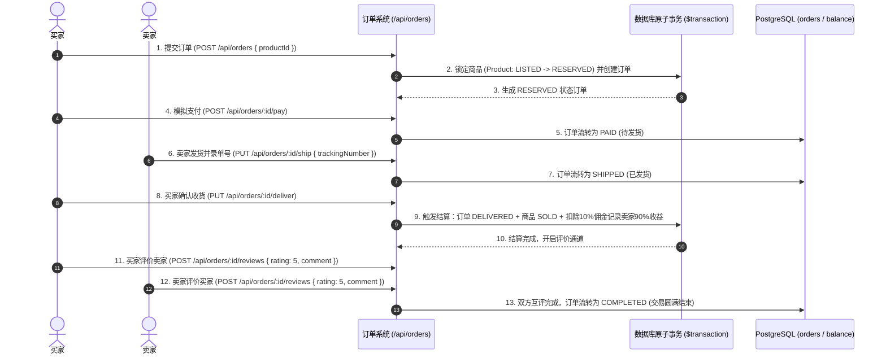

# 02. 订单交易与资金评价模块全栈开发实战教学

本教程将带你攻克 C2C 二手交易系统中最核心的**交易闭环、并发原子事务、状态机流转、10% 平台抽成计算与双向防刷信用评价**的前后端全栈开发。

---

## 目录
1. [交易履约与资金流转全景图](#1-交易履约与资金流转全景图)
2. [后端实战：订单生命周期与原子事务](#2-后端实战订单生命周期与原子事务)
   - [步骤 1：订单与交易控制层 (orderController.ts)](#步骤-1订单与交易控制层-ordercontrollerts)
   - [步骤 2：双向信用评价控制层 (reviewController.ts)](#步骤-2双向信用评价控制层-reviewcontrollerts)
   - [步骤 3：路由定义与挂载 (routes/orders.ts & index.ts)](#步骤-3路由定义与挂载-routesordersts--indexts)
3. [前端实战：订单履约与交易互动画面](#3-前端实战订单履约与交易互动画面)
   - [步骤 1：订单 API 封装与类型声明](#步骤-1订单-api-封装与类型声明)
   - [步骤 2：订单列表中心 (MyOrders.tsx)](#步骤-2订单列表中心-myorderstsx)
   - [步骤 3：订单履约详情与状态时间轴 (OrderDetail.tsx)](#步骤-3订单履约详情与状态时间轴-orderdetailtsx)
   - [步骤 4：星级评价交互弹窗 (RatingModal.tsx)](#步骤-4星级评价交互弹窗-ratingmodaltsx)
4. [核心架构难点深度拆解](#4-核心架构难点深度拆解)

---

## 1. 交易履约与资金流转全景图

C2C 交易的核心是由**订单状态机驱动的事件链**：



---

## 2. 后端实战：订单生命周期与原子事务

### 步骤 1：订单与交易控制层 (`backend/src/controllers/orderController.ts`)

#### 1.1 编写 `createOrder`（下单与原子锁）
```typescript
import { Context } from "hono";
import { prisma } from "../lib/prisma.js";
import { ProductStatus, OrderStatus, BalanceTxType, TxStatus } from "@prisma/client";

/**
 * 1. 下单购买商品 (POST /api/orders)
 * 必须使用原子事务，防止商品被多人并发抢购（超卖防御）
 */
export const createOrder = async (c: Context) => {
  try {
    const user = c.get("jwtPayload");
    const buyerId = user?.sub || user?.id;

    const { productId } = await c.req.json<{ productId: string }>();

    if (!productId) {
      return c.json({ success: false, error: "商品ID不能为空" }, 400);
    }

    // 1. 查询商品并检查在售状态
    const product = await prisma.product.findUnique({
      where: { id: productId },
    });

    if (!product || product.status !== ProductStatus.LISTED) {
      return c.json({ success: false, error: "商品不可购买或已被拍下" }, 400);
    }

    // 2. 业务规则校验：禁止购买自己发布的商品
    if (product.sellerId === buyerId) {
      return c.json({ success: false, error: "不能购买自己发布的商品" }, 400);
    }

    // 3. 执行原子事务：锁定商品状态 + 创建订单
    const order = await prisma.$transaction(async (tx) => {
      // 锁定商品
      await tx.product.update({
        where: { id: productId },
        data: { status: ProductStatus.RESERVED },
      });

      // 生成订单
      return await tx.order.create({
        data: {
          productId,
          buyerId,
          sellerId: product.sellerId,
          status: OrderStatus.RESERVED,
        },
        include: {
          product: { include: { images: { take: 1 } } },
          seller: { select: { id: true, username: true } },
          buyer: { select: { id: true, username: true } },
        },
      });
    });

    return c.json({ success: true, message: "注文が確定しました（已下单）。", data: order }, 201);
  } catch (error) {
    console.error("创建订单失败:", error);
    return c.json({ success: false, error: "下单失败，请稍后重试" }, 500);
  }
};
```

#### 1.2 编写 `payOrder`（模拟支付）
```typescript
/**
 * 2. 模拟支付 (POST /api/orders/:id/pay)
 */
export const payOrder = async (c: Context) => {
  try {
    const user = c.get("jwtPayload");
    const buyerId = user?.sub || user?.id;
    const orderId = c.req.param("id");

    const order = await prisma.order.findUnique({ where: { id: orderId } });

    if (!order) return c.json({ success: false, error: "订单不存在" }, 404);
    if (order.buyerId !== buyerId) return c.json({ success: false, error: "无权操作他人订单" }, 403);
    if (order.status !== OrderStatus.RESERVED) {
      return c.json({ success: false, error: "订单当前状态不可支付" }, 400);
    }

    const updated = await prisma.order.update({
      where: { id: orderId },
      data: { status: OrderStatus.PAID },
    });

    return c.json({ success: true, message: "支払いが完了しました（支付成功）。", data: updated });
  } catch (error) {
    return c.json({ success: false, error: "支付处理失败" }, 500);
  }
};
```

#### 1.3 编写 `shipOrder`（卖家发货）
```typescript
/**
 * 3. 卖家发货 (PUT /api/orders/:id/ship)
 */
export const shipOrder = async (c: Context) => {
  try {
    const user = c.get("jwtPayload");
    const sellerId = user?.sub || user?.id;
    const orderId = c.req.param("id");
    const { trackingNumber } = await c.req.json<{ trackingNumber?: string }>();

    const order = await prisma.order.findUnique({ where: { id: orderId } });

    if (!order) return c.json({ success: false, error: "订单不存在" }, 404);
    if (order.sellerId !== sellerId) return c.json({ success: false, error: "只有卖家可执行发货" }, 403);
    if (order.status !== OrderStatus.PAID) {
      return c.json({ success: false, error: "订单未支付，不能发货" }, 400);
    }

    const updated = await prisma.order.update({
      where: { id: orderId },
      data: {
        status: OrderStatus.SHIPPED,
        trackingNumber: trackingNumber || "TRACK-DUMMY-8888",
      },
    });

    return c.json({ success: true, message: "商品を発送しました（已发货）。", data: updated });
  } catch (error) {
    return c.json({ success: false, error: "发货更新失败" }, 500);
  }
};
```

#### 1.4 编写 `deliverOrder`（确认收货与 10% 佣金结算）
```typescript
/**
 * 4. 买家确认收货并结算 (PUT /api/orders/:id/deliver)
 */
export const deliverOrder = async (c: Context) => {
  try {
    const user = c.get("jwtPayload");
    const buyerId = user?.sub || user?.id;
    const orderId = c.req.param("id");

    const order = await prisma.order.findUnique({
      where: { id: orderId },
      include: { product: true },
    });

    if (!order) return c.json({ success: false, error: "订单不存在" }, 404);
    if (order.buyerId !== buyerId) return c.json({ success: false, error: "只有买家可确认收货" }, 403);
    if (order.status !== OrderStatus.SHIPPED) {
      return c.json({ success: false, error: "商品未处于发货状态" }, 400);
    }

    // 计算 10% 平台抽成与 90% 卖家净收益
    const totalAmount = Number(order.product.price);
    const platformFee = Math.round(totalAmount * 0.1 * 100) / 100;
    const netAmount = Math.round((totalAmount - platformFee) * 100) / 100;

    // 原子事务结算
    const updated = await prisma.$transaction(async (tx) => {
      // 1. 订单置为已收货
      const o = await tx.order.update({
        where: { id: orderId },
        data: { status: OrderStatus.DELIVERED },
      });

      // 2. 商品最终置为 SOLD (已售出)
      await tx.product.update({
        where: { id: order.productId },
        data: { status: ProductStatus.SOLD },
      });

      // 3. 记录卖家收入流水 (入账)
      await tx.balanceTransaction.create({
        data: {
          userId: order.sellerId,
          orderId: order.id,
          amount: totalAmount,
          fee: platformFee,
          netAmount: netAmount,
          type: BalanceTxType.CREDIT,
          status: TxStatus.COMPLETED,
        },
      });

      return o;
    });

    return c.json({ success: true, message: "受取を確認しました。売上が反映されました（收货成功，资金已入账）。", data: updated });
  } catch (error) {
    console.error("确认收货结算失败:", error);
    return c.json({ success: false, error: "确认收货失败" }, 500);
  }
};
```

#### 1.5 编写 `getMyOrders` 与 `getOrderById`
```typescript
/**
 * 5. 获取我的订单列表 (GET /api/orders?role=buyer|seller)
 */
export const getMyOrders = async (c: Context) => {
  try {
    const user = c.get("jwtPayload");
    const userId = user?.sub || user?.id;
    const role = c.req.query("role") || "buyer";

    const orders = await prisma.order.findMany({
      where: role === "seller" ? { sellerId: userId } : { buyerId: userId },
      include: {
        product: { include: { images: { take: 1 } } },
        buyer: { select: { id: true, username: true } },
        seller: { select: { id: true, username: true } },
        reviews: true,
      },
      orderBy: { createdAt: "desc" },
    });

    return c.json({ success: true, data: orders });
  } catch (error) {
    return c.json({ success: false, error: "获取订单列表失败" }, 500);
  }
};

/**
 * 6. 获取订单详情 (GET /api/orders/:id)
 */
export const getOrderById = async (c: Context) => {
  try {
    const user = c.get("jwtPayload");
    const userId = user?.sub || user?.id;
    const orderId = c.req.param("id");

    const order = await prisma.order.findUnique({
      where: { id: orderId },
      include: {
        product: { include: { images: true, category: true } },
        buyer: { select: { id: true, username: true, email: true } },
        seller: { select: { id: true, username: true, email: true } },
        reviews: true,
      },
    });

    if (!order) return c.json({ success: false, error: "订单不存在" }, 404);
    // 水平越权校验：只有买卖双方可以查看该订单
    if (order.buyerId !== userId && order.sellerId !== userId) {
      return c.json({ success: false, error: "无权查看该订单" }, 403);
    }

    return c.json({ success: true, data: order });
  } catch (error) {
    return c.json({ success: false, error: "获取订单详情失败" }, 500);
  }
};
```

---

### 步骤 2：双向信用评价控制层 (`backend/src/controllers/reviewController.ts`)

```typescript
import { Context } from "hono";
import { prisma } from "../lib/prisma.js";
import { ReviewRole, OrderStatus } from "@prisma/client";

/**
 * 提交交易评价 (POST /api/orders/:id/reviews)
 */
export const submitReview = async (c: Context) => {
  try {
    const user = c.get("jwtPayload");
    const currentUserId = user?.sub || user?.id;
    const orderId = c.req.param("id");

    const { rating, comment } = await c.req.json<{ rating: number; comment?: string }>();

    if (!rating || rating < 1 || rating > 5) {
      return c.json({ success: false, error: "请给出 1 到 5 星的评分" }, 400);
    }

    const order = await prisma.order.findUnique({
      where: { id: orderId },
      include: { reviews: true },
    });

    if (!order) return c.json({ success: false, error: "订单不存在" }, 404);

    // 校验身份与角色
    let reviewerRole: ReviewRole;
    let revieweeId: string;

    if (currentUserId === order.buyerId) {
      reviewerRole = ReviewRole.BUYER;
      revieweeId = order.sellerId;
    } else if (currentUserId === order.sellerId) {
      reviewerRole = ReviewRole.SELLER;
      revieweeId = order.buyerId;
    } else {
      return c.json({ success: false, error: "您不是该订单的当事人，无法评价" }, 403);
    }

    // 校验订单状态（只有 DELIVERED 或 COMPLETED 可以评价）
    if (order.status !== OrderStatus.DELIVERED && order.status !== OrderStatus.COMPLETED) {
      return c.json({ success: false, error: "商品未送达确认，不可评价" }, 400);
    }

    // 检查是否已经评价过（数据库已具备 @@unique([orderId, reviewerRole]) 防刷约束）
    const existing = order.reviews.find((r) => r.reviewerRole === reviewerRole);
    if (existing) {
      return c.json({ success: false, error: "您已对该订单提交过评价，不可重复提交" }, 400);
    }

    // 写入评价并检查是否双方均已评价
    const result = await prisma.$transaction(async (tx) => {
      const review = await tx.review.create({
        data: {
          orderId,
          reviewerId: currentUserId,
          revieweeId,
          reviewerRole,
          rating: Number(rating),
          comment,
        },
      });

      // 若对方也已完成评价，则订单流转为最终态 COMPLETED
      const allReviews = await tx.review.findMany({ where: { orderId } });
      if (allReviews.length >= 2) {
        await tx.order.update({
          where: { id: orderId },
          data: { status: OrderStatus.COMPLETED },
        });
      }

      return review;
    });

    return c.json({ success: true, message: "評価を投稿しました（评价成功）。", data: result }, 201);
  } catch (error) {
    console.error("提交评价失败:", error);
    return c.json({ success: false, error: "评价提交失败" }, 500);
  }
};
```

---

### 步骤 3：路由定义与挂载

#### 3.1 编写 `backend/src/routes/orders.ts`
```typescript
import { Hono } from "hono";
import { authenticate } from "../middleware/authMiddleware.js";
import {
  createOrder,
  payOrder,
  shipOrder,
  deliverOrder,
  getMyOrders,
  getOrderById,
} from "../controllers/orderController.js";
import { submitReview } from "../controllers/reviewController.js";

const orderRouter = new Hono();

// 所有订单相关操作均需登录认证
orderRouter.use("*", authenticate());

orderRouter.get("/", getMyOrders);
orderRouter.get("/:id", getOrderById);
orderRouter.post("/", createOrder);
orderRouter.post("/:id/pay", payOrder);
orderRouter.put("/:id/ship", shipOrder);
orderRouter.put("/:id/deliver", deliverOrder);
orderRouter.post("/:id/reviews", submitReview);

export default orderRouter;
```

#### 3.2 挂载至 `backend/src/index.ts`
```typescript
import orders from "./routes/orders.js";
app.route("/api/orders", orders);
```

---

## 3. 前端实战：订单履约与交易互动画面

### 步骤 1：订单 API 封装与类型声明 (`frontend/src/api/orderApi.ts`)
```typescript
import api from "./axios";

export interface Order {
  id: string;
  productId: string;
  buyerId: string;
  sellerId: string;
  status: "RESERVED" | "PAID" | "SHIPPED" | "DELIVERED" | "COMPLETED";
  trackingNumber?: string;
  createdAt: string;
  product: { id: string; title: string; price: string | number; images: { url: string }[] };
  buyer: { id: string; username: string };
  seller: { id: string; username: string };
  reviews?: { id: string; reviewerRole: "BUYER" | "SELLER"; rating: number; comment?: string }[];
}

export const createOrder = (productId: string) => api.post("/orders", { productId });
export const payOrder = (orderId: string) => api.post(`/orders/${orderId}/pay`);
export const shipOrder = (orderId: string, trackingNumber?: string) => api.put(`/orders/${orderId}/ship`, { trackingNumber });
export const deliverOrder = (orderId: string) => api.put(`/orders/${orderId}/deliver`);
export const submitReview = (orderId: string, data: { rating: number; comment?: string }) => api.post(`/orders/${orderId}/reviews`, data);
export const fetchMyOrders = (role: "buyer" | "seller") => api.get<{ success: boolean; data: Order[] }>(`/orders?role=${role}`);
export const fetchOrderById = (id: string) => api.get<{ success: boolean; data: Order }>(`/orders/${id}`);
```

---

### 步骤 2：星级评价交互弹窗 (`frontend/src/components/RatingModal.tsx`)

封装可复用的五星评价模态框：
- 渲染 1~5 颗交互式星星图标（Hover 高亮与 Click 选中）。
- 文本域输入评价内容（`comment`）。
- 调用 `submitReview` API 提交后关闭弹窗并刷新订单状态。

---

## 4. 核心架构难点深度拆解

### 💡 为什么创建订单必须加 `prisma.$transaction`？
- **高并发死锁与超卖场景**：如果两名买家在同一毫秒内点击“购买”，在没有事务保护时，两个请求可能同时查询到 `product.status === LISTED`，随后各自生成一笔订单，导致**一件商品被售出两次**！
- **解决方案**：在 `$transaction` 中，首先执行 `UPDATE products SET status = 'RESERVED' WHERE id = ...`，PostgreSQL 会在行级别加上排他写锁（Exclusive Row Lock），第二个并发请求在更新时会被阻塞或因状态不符合而回滚抛错，彻底消除超卖风险。

### 💡 佣金计算中的精度问题
- 手续费计算 `Math.round(totalAmount * 0.1 * 100) / 100` 保证四舍五入精确到小数点后两位，避免出现 `99.999999` 的浮点残差。
